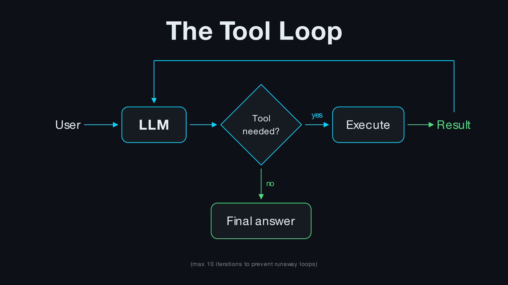

# Unit 1: The Augmented LLM

The foundation for all agent systems: an LLM enhanced with **tools** and **retrieval** (no **memory** for now).


## Quick Start

```bash
# Install dependencies
uv sync

# Run examples
uv run python -m examples.01_example_calculator_tool
uv run python -m examples.02_example_retrieval
```

## Project Structure

```
src/
    tools/
        base.py          # Tool abstract base class
        registry.py      # Tool registration & lookup
        calculator.py    # Example tool
    retrieval/
        chunker.py       # Text splitting
        embedder.py      # sentence-transformers wrapper
        index.py         # Numpy vector store
        tool.py          # Retrieval as a tool
    executor.py          # Tool execution with error handling
    llm.py               # LLM API wrapper with tool loop
```

## Examples

### 1. Calculator Tool

The LLM decides when to use tools based on the query:

```
User: What is 15 * 7?
Assistant: The result of 15 multiplied by 7 is 105.
```

### 2. Retrieval + Calculator

Combining multiple tools -- retrieval finds the facts, calculator evaluates mathematical expressions:

```
User: How tall is the Eiffel Tower in feet? (1 meter = 3.28 feet)
src.executor - Executing tool search_documents
src.executor - Successful execution
src.executor - Executing tool calculator
src.executor - Successful execution
Assistant: The Eiffel Tower is approximately 1,082 feet tall (330 meters x 3.28 feet/meter).
```

## Key Concepts

**Tool Design > Prompt Engineering**

Good tools have:
- Clear descriptions (the LLM reads these to decide when to use them)
- Input schemas with examples
- Graceful error handling

**The Tool Loop**



## Requirements

- Python 3.12+
- Anthropic API key (set `ANTHROPIC_API_KEY` env var)
